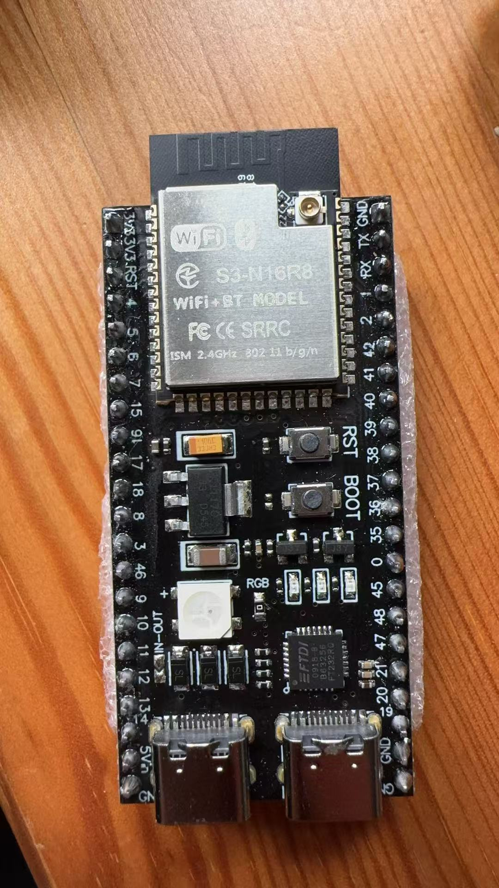
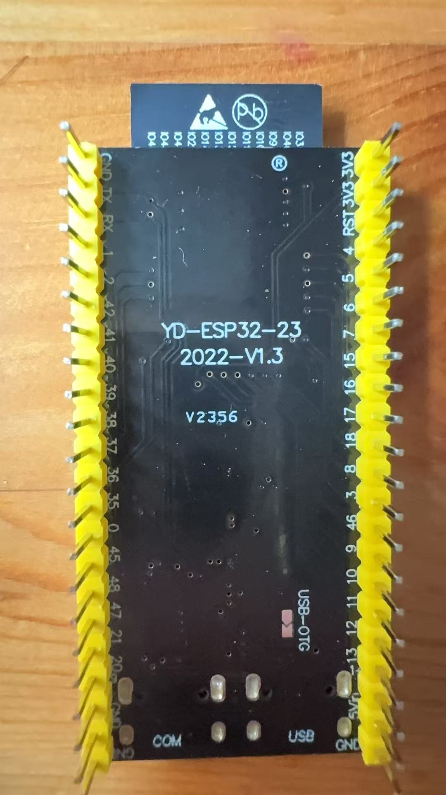
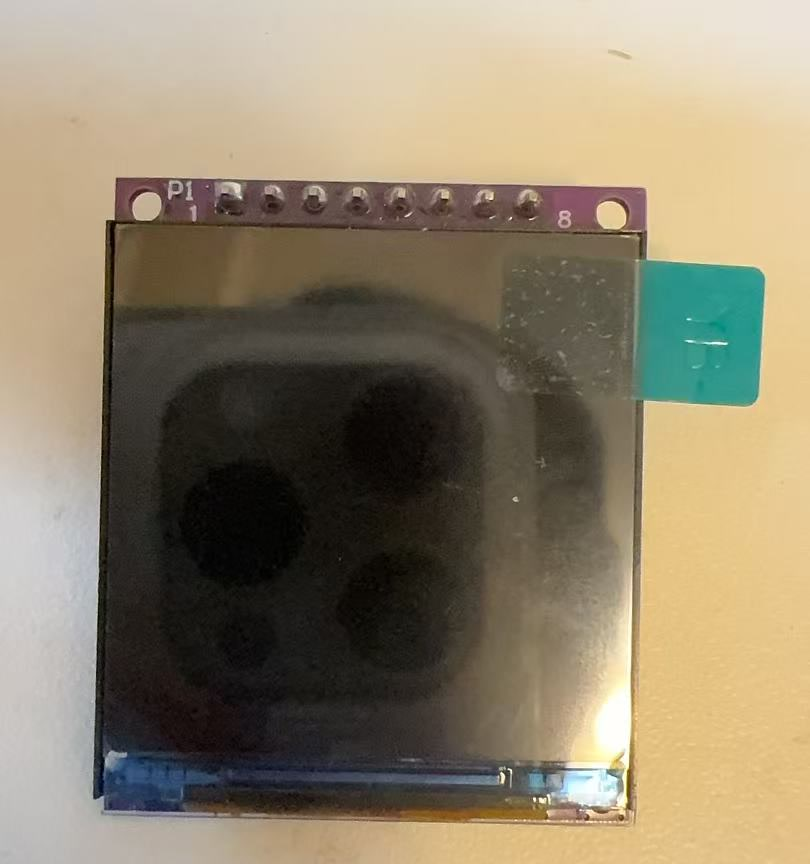
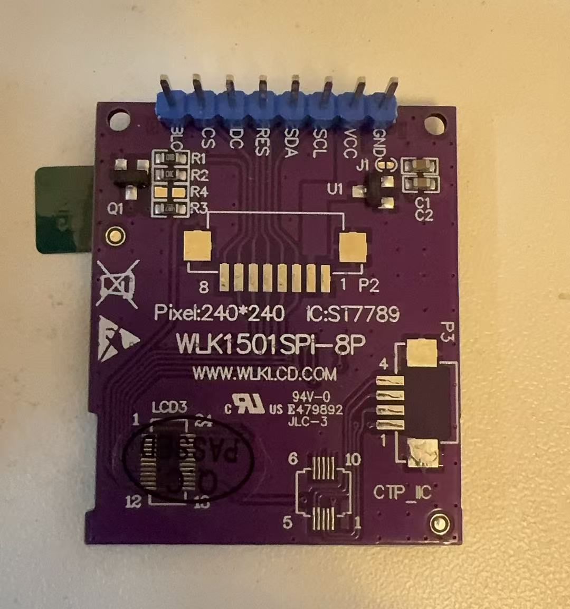
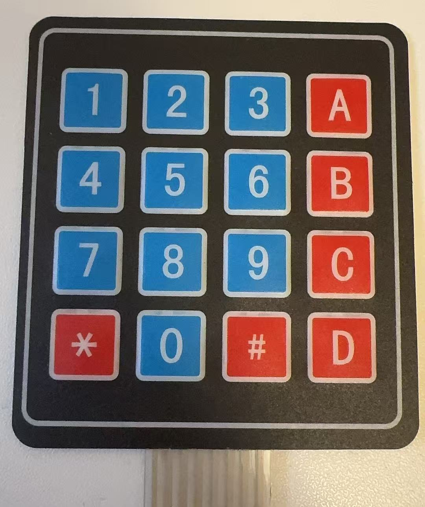
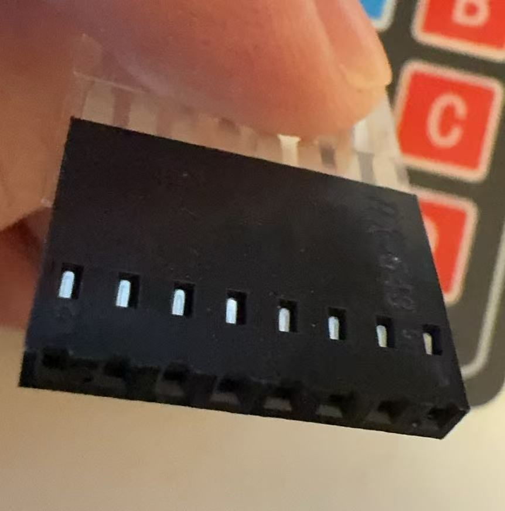
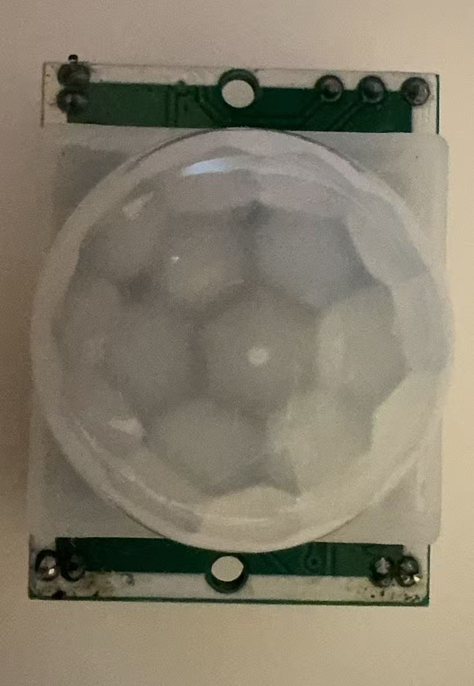
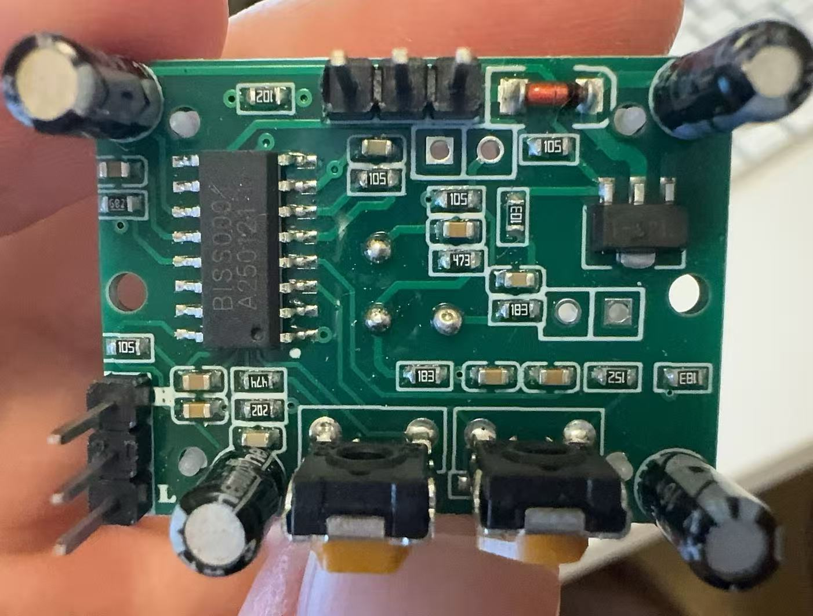

# Devices

> Devices I can use for my projects.

---

## 🧠 Microcontrollers

### ESP32-S3 — YD-ESP32-23

| Top | Bottom |
|:---:|:---:|
|  |  |

Dual-core Xtensa LX7 running at 240 MHz with 16 MB flash and 8 MB PSRAM. Includes WiFi 2.4 GHz, BLE 5.0, dual USB-C ports, 43 GPIOs, and an onboard RGB LED. A versatile board for any IoT or embedded project.

📄 [Brief](esp32-s3-brief.json) · [Full spec](esp32-s3.json)

---

## 🖥️ Displays

### LCD 1602 I2C

| Top | Bottom |
|:---:|:---:|
|  |  |

16x2 character LCD with an I2C backpack (PCF8574T). Blue backlight with white text, controlled via just 2 wires (SDA/SCL) at default address 0x27. Onboard potentiometer for contrast adjustment.

📄 [Brief](lcd-1602-i2c-brief.json) · [Full spec](lcd-1602-i2c.json)

---

### LCD 1.54" ST7789 SPI

| Top | Bottom |
|:---:|:---:|
|  |  |

1.54" IPS TFT color LCD with an ST7789 driver and SPI interface. 240x240 pixel resolution with 65K colors, LED backlight, and an optional capacitive touch panel via FPC connector. Runs on 3.3 V or 5 V with an 8-pin header (BLK, CS, DC, RES, SDA, SCL, VCC, GND).

📄 [Brief](lcd-st7789-spi-brief.json) · [Full spec](lcd-st7789-spi.json)

---

## 🔊 Audio

### DAC PCM5102A

| Top | Bottom |
|:---:|:---:|
|  |  |

I2S stereo DAC delivering 32-bit / 384 kHz audio with 112 dB SNR. Features a 3.5 mm headphone jack and runs on 3.3 V or 5 V. Perfect for high-quality audio output from any I2S-capable microcontroller.

📄 [Brief](dac-pcm5102-brief.json) · [Full spec](dac-pcm5102.json)

---

### Microphone INMP441

| Top | Bottom |
|:---:|:---:|
|  |  |

I2S MEMS digital microphone with 24-bit output, 61 dB SNR, and a 60 Hz – 15 kHz frequency range. Runs on 1.8–3.3 V and supports channel selection via the L/R pin. Compact round form factor ideal for voice capture on any I2S-capable microcontroller.

📄 [Brief](mic-inmp441-brief.json) · [Full spec](mic-inmp441.json)

---

## ⌨️ Input

### Keypad 4x4 Matrix Membrane

| Front | Connector |
|:---:|:---:|
|  |  |

16-key membrane matrix keypad (1–9, 0, A–D, *, #) scanned via 8 passive lines (4 rows + 4 columns). No power supply needed — purely passive switches on a flexible substrate. Connects through a single 8-pin female header at 2.54 mm pitch with internal pull-ups required on the MCU side.

📄 [Brief](keypad-4x4-matrix-brief.json) · [Full spec](keypad-4x4-matrix.json)

---

## 📡 Sensors

### PIR HC-SR501

| Top | Bottom |
|:---:|:---:|
|  |  |

Passive infrared motion sensor powered by the BISS0001 chip. Detects movement within a 3–7 m range over a 120° cone (both adjustable via potentiometer). Digital output goes HIGH (3.3 V) on detection. Runs on 4.5–20 V with a second potentiometer for hold-time delay (0.3 s – 5 min) and a jumper for single/repeatable trigger mode.

📄 [Brief](pir-hcsr501-brief.json) · [Full spec](pir-hcsr501.json)
