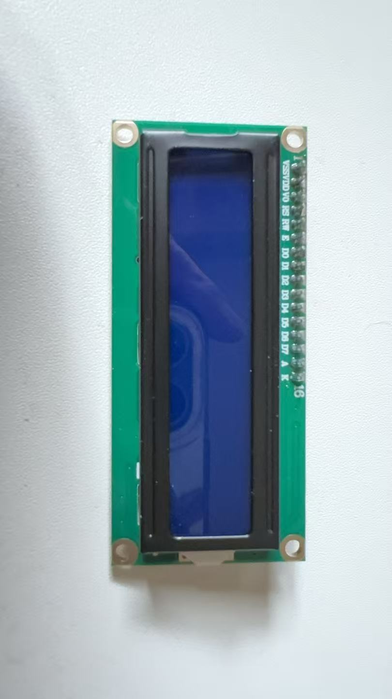
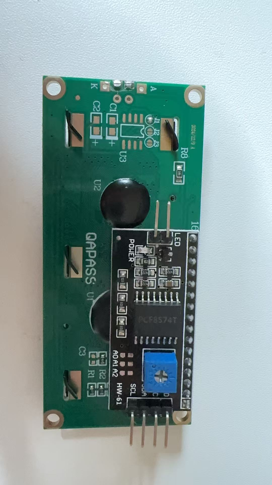
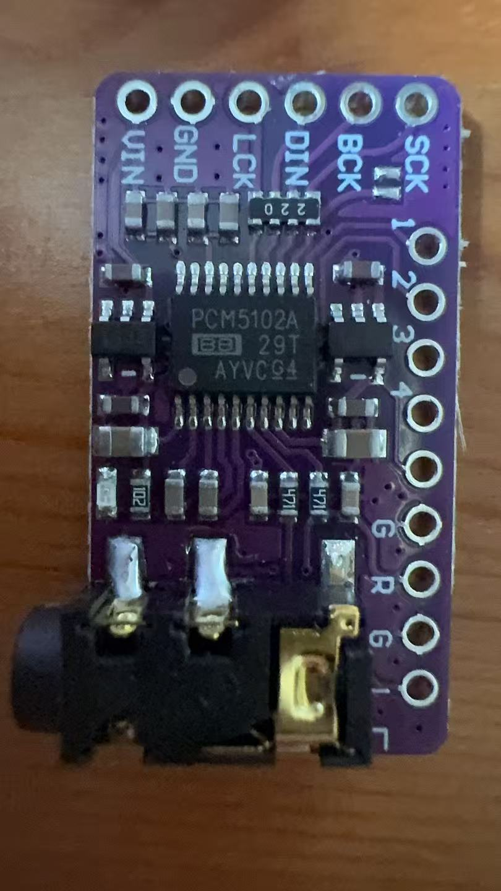
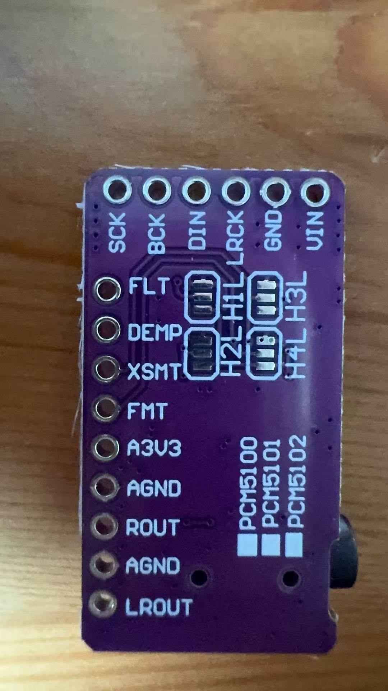
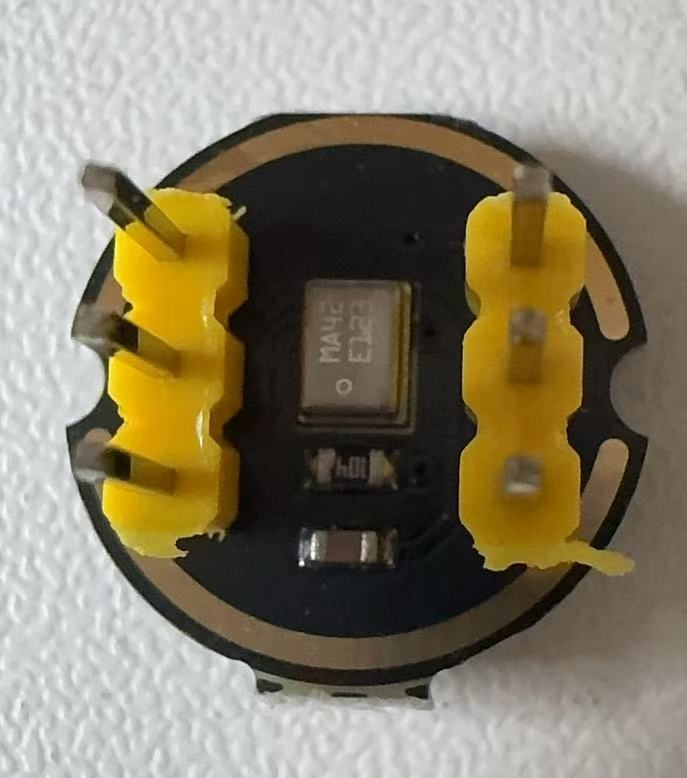
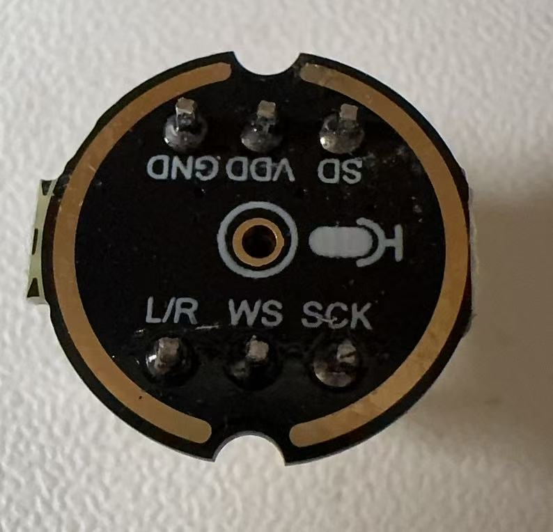

# Devices

> Devices I can use for my projects.

---

## 🧠 Microcontrollers

### ESP32-S3 — YD-ESP32-23

| Top | Bottom |
|:---:|:---:|
|  |  |

Dual-core Xtensa LX7 running at 240 MHz with 16 MB flash and 8 MB PSRAM. Includes WiFi 2.4 GHz, BLE 5.0, dual USB-C ports, 43 GPIOs, and an onboard RGB LED. A versatile board for any IoT or embedded project.

📄 [Brief](esp32-s1-brief.json) · [Full spec](esp32-s1.json)

---

## 🖥️ Displays

### LCD 1602 I2C

| Top | Bottom |
|:---:|:---:|
|  |  |

16x2 character LCD with an I2C backpack (PCF8574T). Blue backlight with white text, controlled via just 2 wires (SDA/SCL) at default address 0x27. Onboard potentiometer for contrast adjustment.

📄 [Brief](lcd-1602-i2c-brief.json) · [Full spec](lcd-1602-i2c.json)

---

## 🔊 Audio

### DAC PCM5102A

| Top | Bottom |
|:---:|:---:|
|  |  |

I2S stereo DAC delivering 32-bit / 384 kHz audio with 112 dB SNR. Features a 3.5 mm headphone jack and runs on 3.3 V or 5 V. Perfect for high-quality audio output from any I2S-capable microcontroller.

📄 [Brief](dac-pcm5102-brief.json) · [Full spec](dac-pcm5102.json)

---

### Microphone INMP441

| Top | Bottom |
|:---:|:---:|
|  |  |

I2S MEMS digital microphone with 24-bit output, 61 dB SNR, and a 60 Hz – 15 kHz frequency range. Runs on 1.8–3.3 V and supports channel selection via the L/R pin. Compact round form factor ideal for voice capture on any I2S-capable microcontroller.

📄 [Brief](mic-inmp441-brief.json) · [Full spec](mic-inmp441.json)
