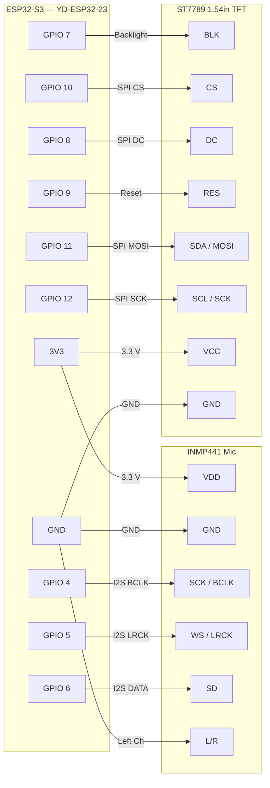
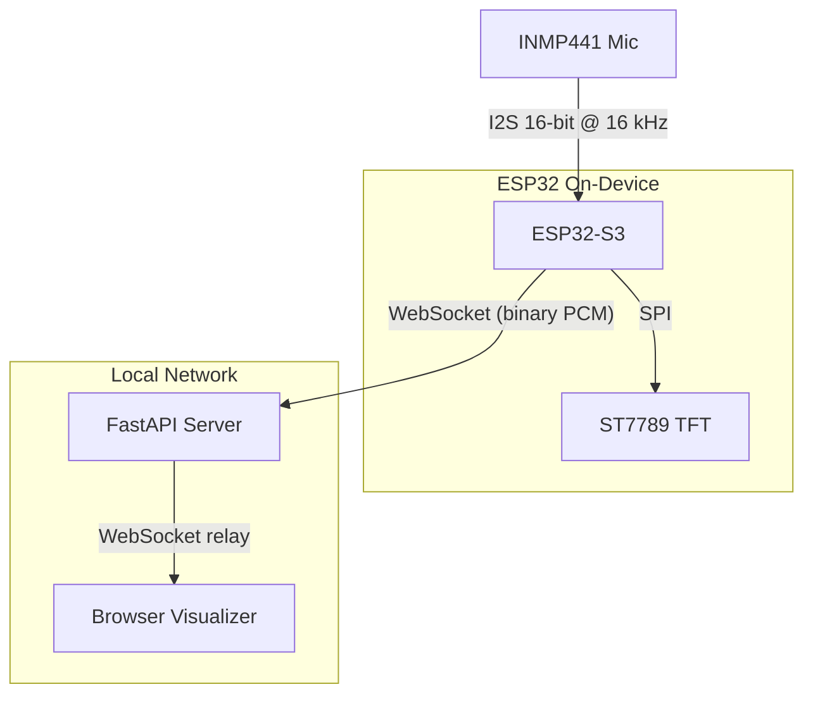

# Wave Visualizer

Real-time audio wave visualizer: ESP32-S3 captures sound via an INMP441 I2S microphone, displays a colour waveform with WiFi/BT status icons on a 240x240 ST7789 TFT, and streams audio over WiFi to a browser-based oscilloscope.

---

## Wiring Diagram



### Pin Reference Table

| ESP32-S3 Pin | Connects To | Protocol | Notes |
|:------------:|:-----------:|:--------:|:------|
| **3V3** | INMP441 VDD | Power | 3.3 V supply |
| **GND** | INMP441 GND | Power | |
| **GPIO 4** | INMP441 SCK | I2S BCLK | Bit clock |
| **GPIO 5** | INMP441 WS | I2S LRCK | Word select / L-R clock |
| **GPIO 6** | INMP441 SD | I2S DATA | Serial data (mic output) |
| **GND** | INMP441 L/R | Config | Tied LOW = left channel |
| **3V3** | TFT VCC | Power | 3.3 V supply (module has on-board regulator) |
| **GND** | TFT GND | Power | |
| **GPIO 7** | TFT BLK | Control | Backlight enable (active high) |
| **GPIO 8** | TFT DC | SPI | Data/command select |
| **GPIO 9** | TFT RES | Control | Hardware reset (active low) |
| **GPIO 10** | TFT CS | SPI | Chip select (active low) |
| **GPIO 11** | TFT SDA | SPI MOSI | Serial data input |
| **GPIO 12** | TFT SCL | SPI SCK | Serial clock |

> **Note:** The ST7789 module runs at 3.3 V logic — no level shifter required with the ESP32-S3.

---

## System Architecture


---

## Data Flow



---

## Display Layout (240 x 240)

```
+--------------------------------------+
|  [WiFi]                      [BT]    |   Status bar (24 px)
|                                      |
|         "Waiting for BLE"            |   Notification (centred)
|                                      |
|    ██                                |
|    ██ ██                ██           |
|    ██ ██ ██    ██ ██    ██           |   Waveform bars (centred)
|    ██ ██ ██ ██ ██ ██ ██ ██ ██        |
|                                      |
+--------------------------------------+
```

- **Top-left**: WiFi signal icon — cyan when connected, dark grey when disconnected.
- **Top-right**: Bluetooth icon — cyan when a BLE client is connected, dark grey when only advertising.
- **Centre**: Important notification text (status messages).
- **Lower centre**: Real-time waveform bar graph (28 bars, colour-coded green/yellow/red by amplitude).

---

## Setup & Deploy

### Prerequisites

| Tool | Version | Purpose |
|------|---------|---------|
| [PlatformIO](https://platformio.org/) | latest | Build & flash ESP32 firmware |
| [Python](https://python.org/) | >= 3.11 | Server runtime |
| [Poetry](https://python-poetry.org/) | >= 1.7 | Python dependency management |
| Chrome or Edge | latest | Web Bluetooth requires a Chromium browser |

### 1. Flash the Firmware

```bash
# From the project root
pio run -t upload          # compile & flash
pio device monitor         # open serial monitor (115200 baud)
```

On first boot the ESP32 will:
- Start BLE advertising as **"Wizardoz-Wave"**
- Begin reading the INMP441 microphone
- Display `Waiting for BLE` on the TFT

If WiFi credentials were previously saved, it will auto-connect.

### 2. Start the Server

```bash
cd server
poetry install             # install dependencies (first time)
poetry run serve           # start FastAPI on http://0.0.0.0:8000
```

The server binds to `0.0.0.0:8000` so any device on your LAN can reach it.

### 3. Configure WiFi via the Dashboard

1. Open **http://localhost:8000** in Chrome/Edge
2. Click **Scan for Devices** — the browser BLE picker will appear
3. Select your ESP32 (shows as "Wizardoz-Wave")
4. Enter your WiFi SSID and password, then click **Configure WiFi**
5. The status badge will update to **CONNECTED** with the device's IP address

The ESP32 saves the credentials in flash (NVS). On subsequent boots it will reconnect automatically — no need to re-provision.

### 4. View the Waveform

1. Navigate to **http://localhost:8000/visualizer**
2. Select your device from the dropdown and click **Connect**
3. The oscilloscope waveform, frequency spectrum, and level meter update in real time

Meanwhile, the ST7789 TFT on the ESP32 itself shows a colour bar-graph visualizer with WiFi and Bluetooth status icons.

---

## Project Structure

```
wizardoz/
├── include/
│   └── pin_config.h               # GPIO & SPI pin definitions
├── lib/
│   └── WizardozConnect/           # Reusable BLE WiFi provisioning library
│       ├── WizardozConnect.h
│       └── WizardozConnect.cpp
├── src/
│   ├── main.cpp                   # Wave visualizer firmware
│   └── README.md                  # ← you are here
├── server/                        # FastAPI backend
│   ├── pyproject.toml
│   ├── README.md
│   └── wizardoz_server/
│       ├── main.py                # App + WebSocket relay
│       ├── static/css/style.css
│       ├── static/js/ble-connect.js
│       ├── static/js/visualizer.js
│       └── templates/
│           ├── base.html
│           ├── dashboard.html
│           └── visualizer.html
└── platformio.ini
```

---

## Troubleshooting

| Symptom | Fix |
|---------|-----|
| BLE scan shows no devices | Make sure the ESP32 is powered and you see `BLE advertising` in serial monitor |
| WiFi status stuck on CONNECTING | Double-check SSID spelling and password; try moving closer to the access point |
| Device configured but not in visualizer list | The server must be reachable from the ESP32. Use the dashboard (not localhost) so the correct LAN IP is sent, or ensure the server runs on your router/gateway |
| TFT shows blank/white screen | Check SPI wiring: MOSI->GPIO11, SCK->GPIO12, CS->GPIO10, DC->GPIO8, RST->GPIO9. Verify VCC is 3.3 V and GND is connected |
| TFT backlight does not turn on | Ensure BLK pin is wired to GPIO 7. The backlight is driven HIGH by firmware |
| Visualizer shows flat line | Confirm the device appears in `/api/devices`; check that the ESP32 serial log shows `[WS] Connection opened` |
| "Web Bluetooth not supported" | Switch to Chrome or Edge — Firefox and Safari do not support the Web Bluetooth API |
