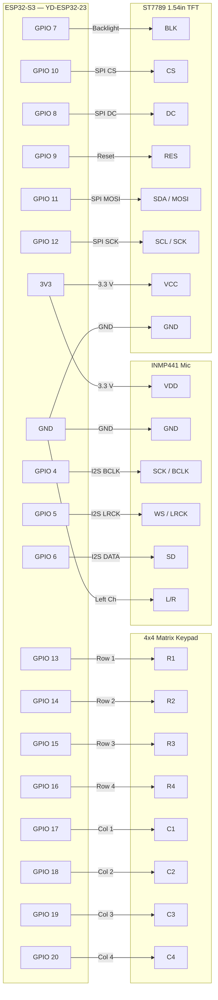
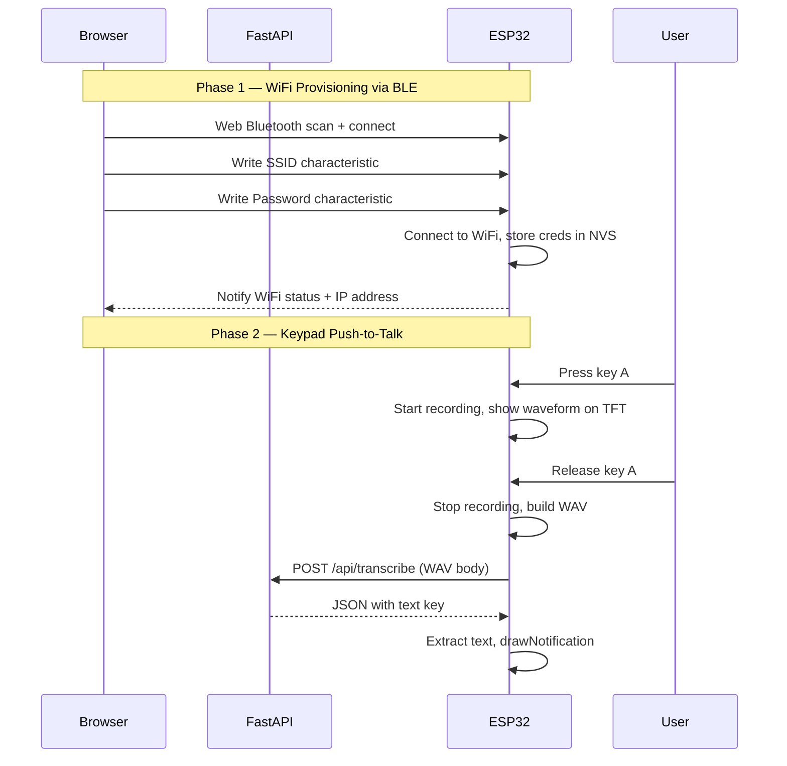
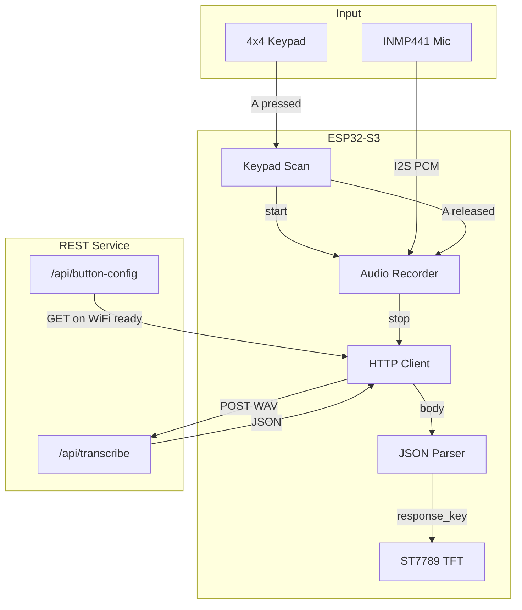

# Wave Visualizer

ESP32-S3 captures sound via an INMP441 I2S microphone and displays a colour waveform with WiFi/BT status icons on a 240x240 ST7789 TFT. **Audio is sent only when key A is released** — no continuous streaming to the laptop.

**Keypad push-to-talk:** Press and hold key **A** on the 4x4 matrix keypad to record audio; the waveform is shown on the LCD only while A is held. Release A to POST the recording to a configurable REST endpoint. The JSON response is parsed by a configurable key and the extracted text is shown on the LCD notification area.

---

## Wiring Diagram



### Pin Reference Table

| ESP32-S3 Pin | Connects To | Protocol | Notes |
|:------------:|:-----------:|:--------:|:------|
| **3V3** | INMP441 VDD | Power | 3.3 V supply |
| **GND** | INMP441 GND | Power | |
| **GPIO 4** | INMP441 SCK | I2S BCLK | Bit clock |
| **GPIO 5** | INMP441 WS | I2S LRCK | Word select / L-R clock |
| **GPIO 6** | INMP441 SD | I2S DATA | Serial data (mic output) |
| **GND** | INMP441 L/R | Config | Tied LOW = left channel |
| **3V3** | TFT VCC | Power | 3.3 V supply (module has on-board regulator) |
| **GND** | TFT GND | Power | |
| **GPIO 7** | TFT BLK | Control | Backlight enable (active high) |
| **GPIO 8** | TFT DC | SPI | Data/command select |
| **GPIO 9** | TFT RES | Control | Hardware reset (active low) |
| **GPIO 10** | TFT CS | SPI | Chip select (active low) |
| **GPIO 11** | TFT SDA | SPI MOSI | Serial data input |
| **GPIO 12** | TFT SCL | SPI SCK | Serial clock |
| **GPIO 13** | Keypad R1 | GPIO | Row 1 (keys 1, 2, 3, A) |
| **GPIO 14** | Keypad R2 | GPIO | Row 2 (keys 4, 5, 6, B) |
| **GPIO 15** | Keypad R3 | GPIO | Row 3 (keys 7, 8, 9, C) |
| **GPIO 16** | Keypad R4 | GPIO | Row 4 (keys *, 0, #, D) |
| **GPIO 17** | Keypad C1 | GPIO | Column 1 (pull-up) |
| **GPIO 18** | Keypad C2 | GPIO | Column 2 (pull-up) |
| **GPIO 19** | Keypad C3 | GPIO | Column 3 (pull-up) |
| **GPIO 20** | Keypad C4 | GPIO | Column 4 (pull-up) |

> **Note:** The ST7789 module runs at 3.3 V logic — no level shifter required with the ESP32-S3.

---

## System Architecture



---

## Data Flow



---

## Display Layout (240 x 240)

```
+--------------------------------------+
|  [WiFi]                      [BT]    |   Status bar (24 px)
|                                      |
|         "Waiting for BLE"            |   Notification (centred)
|                                      |
|    ██                                |
|    ██ ██                ██           |
|    ██ ██ ██    ██ ██    ██           |   Waveform bars (centred)
|    ██ ██ ██ ██ ██ ██ ██ ██ ██        |
|                                      |
+--------------------------------------+
```

- **Top-left**: WiFi signal icon — cyan when connected, dark grey when disconnected.
- **Top-right**: Bluetooth icon — cyan when a BLE client is connected, dark grey when only advertising.
- **Centre**: Notification text — status messages, or when using keypad A:
  - `Recording...` while A is held
  - `Sending...` while POSTing to REST
  - Extracted text from API response (e.g. transcription)
  - `Error: no WiFi`, `Error: request failed`, `Error: no audio` on failure
- **Lower centre**: Waveform bar graph (28 bars, colour-coded green/yellow/red) — **only visible while key A is pressed** (recording). Cleared when A is released.

---

## Setup & Deploy

### Prerequisites

| Tool | Version | Purpose |
|------|---------|---------|
| [PlatformIO](https://platformio.org/) | latest | Build & flash ESP32 firmware |
| [Python](https://python.org/) | >= 3.11 | Server runtime |
| [Poetry](https://python-poetry.org/) | >= 1.7 | Python dependency management |
| Chrome or Edge | latest | Web Bluetooth requires a Chromium browser |

### 1. Flash the Firmware

```bash
# From the project root
pio run -t upload          # compile & flash
pio device monitor         # open serial monitor (115200 baud)
```

On first boot the ESP32 will:
- Start BLE advertising as **"Wizardoz-Wave"**
- Begin reading the INMP441 microphone
- Display `Waiting for BLE` on the TFT

If WiFi credentials were previously saved, it will auto-connect.

### 2. Start the Server

```bash
cd server
poetry install             # install dependencies (first time)
poetry run serve           # start FastAPI on http://0.0.0.0:8000
```

The server binds to `0.0.0.0:8000` so any device on your LAN can reach it.

### 3. Configure WiFi via the Dashboard

1. Open **http://localhost:8000** in Chrome/Edge
2. Click **Scan for Devices** — the browser BLE picker will appear
3. Select your ESP32 (shows as "Wizardoz-Wave")
4. Enter your WiFi SSID and password, then click **Configure WiFi**
5. The status badge will update to **CONNECTED** with the device's IP address

The ESP32 saves the credentials in flash (NVS). On subsequent boots it will reconnect automatically — no need to re-provision.

### 4. Configure Button Mapping (Optional)

1. Navigate to **http://localhost:8000/config**
2. Set endpoint, response key, and content type for each button (A, B, C, D)
3. Click **Save Configuration**
4. The ESP32 fetches this config when it connects to WiFi

### 5. Keypad Push-to-Talk

1. Ensure WiFi is connected and the server is running
2. Press and hold key **A** on the 4x4 keypad — the LCD shows `Recording...`
3. Speak into the microphone
4. Release **A** — the LCD shows `Sending...`, then the text extracted from the API response

---

## Button Configuration

Configure button-to-endpoint mapping via the **Button Config** tab at **http://localhost:8000/config**, or edit [include/button_config.h](include/button_config.h) for compile-time defaults.

The ESP32 fetches config from `GET /api/button-config` when WiFi connects. If the fetch fails, it falls back to the compile-time values in `button_config.h`.

- **endpoint**: Path (e.g. `/api/transcribe`) — uses server host from BLE config. Or use a full URL to override.
- **response_key**: JSON key to extract from the response (e.g. `"text"`, `"transcription"`).
- **content_type**: `audio/wav` or `audio/raw` (16 kHz, 16-bit mono).

---

## Project Structure

```
wizardoz/
├── include/
│   ├── pin_config.h              # GPIO & SPI pin definitions
│   └── button_config.h            # Button-to-REST endpoint mapping
├── lib/
│   └── WizardozConnect/           # Reusable BLE WiFi provisioning library
│       ├── WizardozConnect.h
│       └── WizardozConnect.cpp
├── src/
│   ├── main.cpp                   # Wave visualizer firmware
│   ├── keypad/
│   │   ├── keypad.h
│   │   └── keypad.cpp             # 4x4 matrix scan
│   ├── audio/
│   │   ├── recorder.h
│   │   └── recorder.cpp           # PSRAM buffer, WAV output
│   ├── http/
│   │   ├── audio_client.h
│   │   └── audio_client.cpp       # POST audio, parse JSON
│   └── README.md                  # ← you are here
├── server/                        # FastAPI backend
│   ├── pyproject.toml
│   ├── README.md
│   └── wizardoz_server/
│       ├── main.py                # App + REST API + button config
│       ├── static/css/style.css
│       ├── static/js/ble-connect.js
│       ├── static/js/visualizer.js
│       └── templates/
│           ├── base.html
│           ├── dashboard.html
│           ├── config.html            # Button-to-endpoint config form
│           └── visualizer.html
└── platformio.ini
```

---

## Troubleshooting

| Symptom | Fix |
|---------|-----|
| BLE scan shows no devices | Make sure the ESP32 is powered and you see `BLE advertising` in serial monitor |
| WiFi status stuck on CONNECTING | Double-check SSID spelling and password; try moving closer to the access point |
| Device configured but not in visualizer list | Audio streaming is disabled. Use keypad A for push-to-talk instead |
| TFT shows blank/white screen | Check SPI wiring: MOSI->GPIO11, SCK->GPIO12, CS->GPIO10, DC->GPIO8, RST->GPIO9. Verify VCC is 3.3 V and GND is connected |
| TFT backlight does not turn on | Ensure BLK pin is wired to GPIO 7. The backlight is driven HIGH by firmware |
| Visualizer shows flat line | Audio streaming is disabled. Waveform appears on LCD only when key A is pressed |
| "Web Bluetooth not supported" | Switch to Chrome or Edge — Firefox and Safari do not support the Web Bluetooth API |
| Keypad A shows "Error: request failed" | Ensure server is running and reachable; check endpoint in Button Config page or button_config.h |
| Keypad A shows "Error: no WiFi" | Connect WiFi via BLE provisioning before using push-to-talk |
