# Voice Jump Game

ESP32-S3 voice-controlled endless runner game. A princess runs rightward through pits and blocks. **Shout into the microphone to make her jump!**

## Hardware

- **ESP32-S3** (YD-ESP32-23 with 16MB Flash, 8MB PSRAM)
- **INMP441** I2S microphone (voice detection for jumping)
- **ST7789** 240x240 SPI TFT display

## Game Features

- **Voice-controlled jumping**: Shout or make noise into the mic to jump
- **Obstacles**: Randomly generated blocks (jump over) and pits (jump across)
- **Progressive difficulty**: Speed increases every 500 units
- **Distance tracking**: Score shown below WiFi icon
- **Death animation**: Sad princess face for 2 seconds, then auto-restart
- **Static status icons**: WiFi and Bluetooth icons stay fixed at top corners

## Wiring Diagram

```mermaid
graph LR
    subgraph ESP32_S3 ["ESP32-S3 — YD-ESP32-23"]
        P3V3["3V3"]
        PGND["GND"]
        G4["GPIO 4"]
        G5["GPIO 5"]
        G6["GPIO 6"]
        G7["GPIO 7"]
        G8["GPIO 8"]
        G9["GPIO 9"]
        G10["GPIO 10"]
        G11["GPIO 11"]
        G12["GPIO 12"]
        G13["GPIO 13"]
        G14["GPIO 14"]
        G15["GPIO 15"]
        G16["GPIO 16"]
        G17["GPIO 17"]
        G18["GPIO 18"]
        G19["GPIO 19"]
        G20["GPIO 20"]
    end

    subgraph INMP441 ["INMP441 Mic"]
        VDD["VDD"]
        MGND["GND"]
        SCK["SCK / BCLK"]
        WS["WS / LRCK"]
        SD["SD"]
        LR["L/R"]
    end

    subgraph ST7789 ["ST7789 1.54in TFT"]
        BLK["BLK"]
        CS["CS"]
        DC["DC"]
        RES["RES"]
        MOSI["SDA / MOSI"]
        TSCK["SCL / SCK"]
        VCC["VCC"]
        LGND["GND"]
    end

    P3V3 -->|"3.3 V"| VDD
    PGND -->|"GND"| MGND
    G4 -->|"I2S BCLK"| SCK
    G5 -->|"I2S LRCK"| WS
    G6 -->|"I2S DATA"| SD
    PGND -->|"Left Ch"| LR

    G7  -->|"Backlight"| BLK
    G10 -->|"SPI CS"| CS
    G8  -->|"SPI DC"| DC
    G9  -->|"Reset"| RES
    G11 -->|"SPI MOSI"| MOSI
    G12 -->|"SPI SCK"| TSCK
    P3V3 -->|"3.3 V"| VCC
    PGND -->|"GND"| LGND

    style G13 fill:#333,stroke:#666,stroke-dasharray: 5 5
    style G14 fill:#333,stroke:#666,stroke-dasharray: 5 5
    style G15 fill:#333,stroke:#666,stroke-dasharray: 5 5
    style G16 fill:#333,stroke:#666,stroke-dasharray: 5 5
    style G17 fill:#333,stroke:#666,stroke-dasharray: 5 5
    style G18 fill:#333,stroke:#666,stroke-dasharray: 5 5
    style G19 fill:#333,stroke:#666,stroke-dasharray: 5 5
    style G20 fill:#333,stroke:#666,stroke-dasharray: 5 5
```



### Pin Reference (Keypad Removed)

| ESP32-S3 Pin | Connects To | Protocol | Notes |
|:------------:|:-----------:|:--------:|:------|
| **3V3** | INMP441 VDD | Power | 3.3 V supply |
| **GND** | INMP441 GND | Power | |
| **GPIO 4** | INMP441 SCK | I2S BCLK | Bit clock |
| **GPIO 5** | INMP441 WS | I2S LRCK | Word select |
| **GPIO 6** | INMP441 SD | I2S DATA | Mic output |
| **GND** | INMP441 L/R | Config | Tied LOW |
| **3V3** | TFT VCC | Power | 3.3 V supply |
| **GND** | TFT GND | Power | |
| **GPIO 7** | TFT BLK | Control | Backlight |
| **GPIO 8** | TFT DC | SPI | Data/command |
| **GPIO 9** | TFT RES | Control | Reset |
| **GPIO 10** | TFT CS | SPI | Chip select |
| **GPIO 11** | TFT MOSI | SPI | Serial data |
| **GPIO 12** | TFT SCK | SPI | Serial clock |
| **GPIO 13-20** | — | — | **UNUSED** (were keypad) |

## Display Layout

```
+--------------------------------------+
|  [WiFi]  123              [BT]       |   Status bar (24 px)
|                                      |   Distance below WiFi
|                                      |
|           ___                        |
|          /   \  <- Princess          |
|         /     \                      |
|        [=====]                       |
|    ____|     |____                   |
|   |               |  <- Ground       |
|        #######                       |   Blocks to jump
|                                      |
|   =====      =====                   |   Pits to cross
|                                      |
+--------------------------------------+
```

- **Top-left**: WiFi icon (cyan when connected)
- **Below WiFi**: Distance counter (increments as you run)
- **Top-right**: Bluetooth icon (cyan when BLE client connected)
- **Game area**: Princess, obstacles, ground
- **Controls**: Voice only - shout to jump!

## How to Play

1. **Flash the firmware**: `pio run -t upload`
2. **Power on**: The game starts automatically
3. **Shout to jump**: The princess runs automatically - your voice controls jumping
4. **Avoid obstacles**: Jump over blocks and across pits
5. **Survive**: Distance increases your score

## Game Mechanics

| Feature | Description |
|---------|-------------|
| Jump Trigger | Voice volume > threshold (default: 800) |
| Jump Cooldown | 300ms between jumps |
| Jump Height | Fixed velocity upward |
| Gravity | Pulls princess down continuously |
| Obstacle Types | Blocks (jump over) and Pits (jump across) |
| Difficulty | Speed increases every 500 distance |
| Death | 2-second sad princess animation, then restart |

## Calibration

If the game jumps too easily or not enough, adjust `VOICE_THRESHOLD` in `game/game_engine.h`:

```cpp
#define VOICE_THRESHOLD 800  // Lower = more sensitive, Higher = less sensitive
```

## Build & Flash

```bash
# Upload firmware
pio run -t upload

# Monitor serial output
pio device monitor
```

## Project Structure

```
src/
├── main.cpp              # Game loop, I2S audio
├── game/
│   ├── game_engine.h     # Game state, physics, collision
│   └── game_engine.cpp   # Game logic implementation
└── tft/
    ├── game_display.h    # Display constants and functions
    └── game_display.cpp  # Drawing primitives
```

## Dependencies

- [TFT_eSPI](https://github.com/Bodmer/TFT_eSPI) — Display driver
- [WizardozConnect](../lib/WizardozConnect/) — BLE/WiFi provisioning (optional, for status icons)

## Troubleshooting

| Issue | Solution |
|-------|----------|
| BLE not appearing | Check serial monitor for "BLE advertising" message |
| WiFi won't connect | Verify SSID/password; check signal strength |
| TFT blank | Verify wiring; check backlight GPIO 7 is HIGH |
| Game not responding to voice | Check INMP441 wiring; adjust VOICE_THRESHOLD |
| Jumps too sensitive | Increase VOICE_THRESHOLD value |
| Jumps not registering | Decrease VOICE_THRESHOLD value |

## See Also

- [voice-capture](../templates/voice-capture/) - Audio recording template
- [voice-jump-game](../templates/voice-jump-game/) - This project as standalone template
