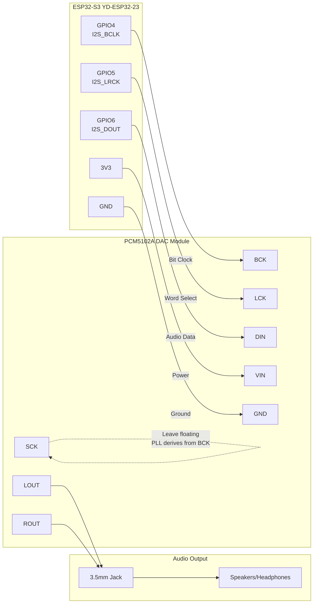
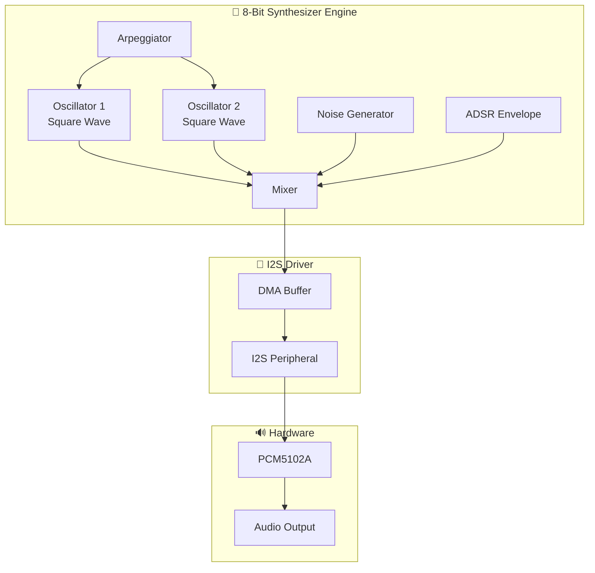
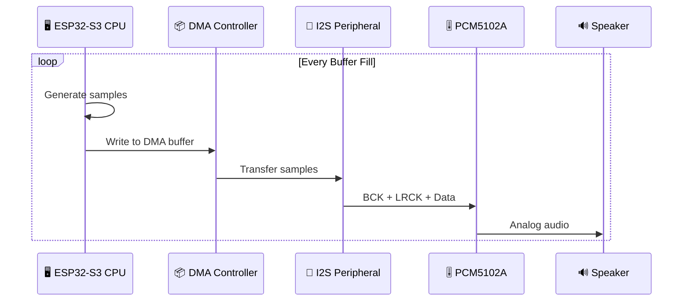

# 🎮 8-Bit Chiptune Synthesizer

> ESP32-S3 + PCM5102A DAC = Retro Gaming Audio Magic! ✨

An authentic 8-bit chiptune music synthesizer that connects the PCM5102A DAC to the ESP32-S3 via I2S interface. Features square wave oscillators, arpeggios, and classic game-style sound effects.

---

## 📋 Overview

This project creates a retro-style synthesizer capable of generating:

- 🔊 **Square wave oscillators** with NES-style duty cycles (50% and 25%)
- 🎵 **Arpeggio patterns** for that classic chiptune chord sound
- 🎹 **Multi-channel mixing** (2 pulse channels + noise)
- 🎼 **Built-in demo song** to showcase the synth

---

## ✅ Compatibility

Both devices are fully compatible for this project:

| Feature | ESP32-S3 | PCM5102A | Match |
|---------|----------|----------|:-----:|
| I2S Support | 2x I2S interfaces | I2S input | ✅ |
| Voltage | 3.3V logic | 3.3V/5V input | ✅ |
| Sample Rates | Configurable | 8-384 kHz | ✅ |
| Bit Depth | Up to 32-bit | 16/24/32-bit | ✅ |

---

## 🔌 Hardware Wiring

Connect the ESP32-S3 to the PCM5102A DAC module as shown:



### 📍 Pin Connection Table

| ESP32-S3 Pin | PCM5102A Pin | Signal | Description |
|:------------:|:------------:|:------:|-------------|
| GPIO4 | BCK | I2S_BCLK | Bit clock (sample rate × bits × 2) |
| GPIO5 | LCK | I2S_LRCK | Left/Right word select |
| GPIO6 | DIN | I2S_DOUT | Serial audio data |
| 3V3 | VIN | Power | 3.3V supply |
| GND | GND | Ground | Common ground |
| — | SCK | (float) | System clock - derived from BCK via PLL |

### ⚙️ PCM5102A Module Configuration

The module has solder bridge configuration. For standard I2S operation:

| Pin | Setting | Effect |
|:---:|:-------:|--------|
| FLT | LOW (default) | Normal latency filter |
| DEMP | LOW (default) | De-emphasis off |
| XSMT | HIGH (default) | Soft mute disabled |
| FMT | LOW (default) | I2S format |
| H2L bridge | Soldered | SCK derived from BCK via internal PLL |

---

## 🏗️ Software Architecture

The synthesizer engine generates authentic 8-bit sound through multiple components:



### 🎛️ Key Components

| Component | Description |
|-----------|-------------|
| **Oscillators** | Square waves with variable duty cycle (50%/25%) |
| **Arpeggiator** | Rapid note switching for chord effects |
| **Envelope** | Simple attack-decay for authentic retro sound |
| **Noise Generator** | White noise for percussion/effects |
| **Mixer** | Combines all channels with volume control |

---

## 📡 Audio Signal Flow

Here's how audio data flows from generation to your speakers:



---

## 💻 Configuration

### I2S Pin Definitions

```cpp
#define I2S_BCLK_PIN  4
#define I2S_LRCK_PIN  5
#define I2S_DOUT_PIN  6
```

### Audio Settings

```cpp
#define SAMPLE_RATE     44100
#define BITS_PER_SAMPLE 16
#define DMA_BUF_COUNT   8
#define DMA_BUF_LEN     256
```

---

## 🎵 Features

| Feature | Description |
|---------|-------------|
| 🎹 **Square Wave Oscillators** | 50% and 25% duty cycles (NES-style) |
| 🔄 **Arpeggio Patterns** | Classic chiptune chord technique |
| 〰️ **Vibrato Effect** | Frequency modulation for expression |
| 🎼 **Note Sequencer** | Tempo-controlled pattern playback |
| 🎚️ **Multi-channel Mixing** | 2 pulse + noise channel |

---

## 🚀 Getting Started

1. **Wire up** the ESP32-S3 to PCM5102A as shown in the diagram above
2. **Build & Upload** using PlatformIO
3. **Connect** speakers or headphones to the DAC's audio output
4. **Enjoy** the retro 8-bit tunes! 🎮

---

## 📝 Notes

- No additional libraries needed — uses built-in ESP32 I2S driver
- The SCK pin on PCM5102A should be left floating (internal PLL derives clock from BCK)
- Ensure common ground between ESP32-S3 and DAC module

---

*Made with ❤️ for retro gaming audio enthusiasts*
